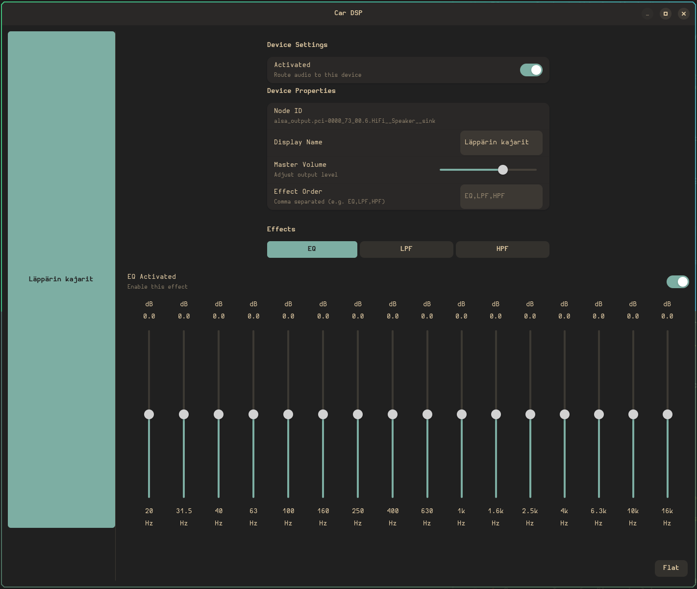

Simple GUI to route audio to multiple outputs and add EQ, LPF, HPF. Uses PipeWire and Adwaita.

To use on NixOS with flakes:

car-dsp.url = "github:asiantuntija/yet-another-car-dsp";

outputs = {self, car-dsp, ...}

car-dsp.nixosModules.default
{
  nixpkgs.overlays = [ car-dsp.overlays.default ];
}

Then in some configuration file:
car-dsp.enable = true;

Fully vibed, some bugs may exist.

<!-- Standard Markdown syntax -->

